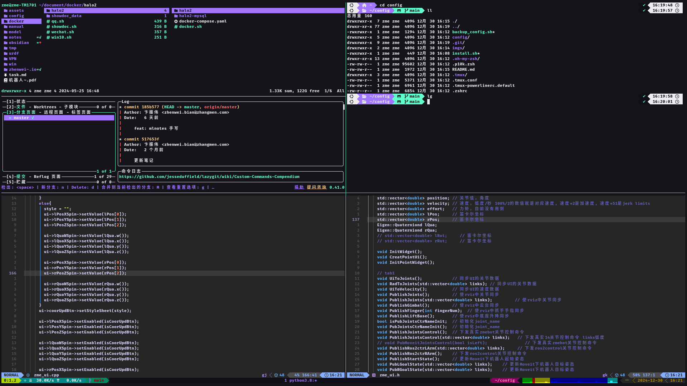
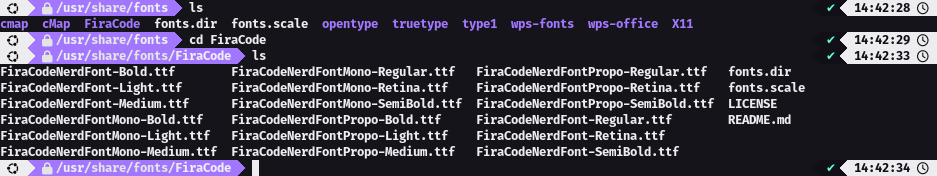

https://github.com/MrVBian/ranger

https://github.com/MrVBian/nvim

https://www.bilibili.com/video/BV1rE411r7hD/



## alacritty

```shell
sudo add-apt-repository ppa:aslatter/ppa
sudo apt update
sudo apt install alacritty
```
## neovim
> apt install 不是最新版本，不兼容lazyvim
```shell
# https://github.com/neovim/neovim/releases/tag/stable
tar xzvf nvim-linux64.tar.gz
rm -rf nvim-linux64.tar.gz
mkdir -p ~/.config/bin/
mv nvim-linux64 ~/.config/bin/nvim
cd /usr/bin
ln -s ~/.config/bin/nvim/bin/nvim nvim
```

### lazyvim
```shell
# https://www.lazyvim.org/installation
git clone https://github.com/LazyVim/starter ~/.config/nvim
rm -rf ~/.config/nvim/.git
```
## lazygit
```shell
LAZYGIT_VERSION=$(curl -s "https://api.github.com/repos/jesseduffield/lazygit/releases/latest" | \grep -Po '"tag_name": *"v\K[^"]*')
curl -Lo lazygit.tar.gz "https://github.com/jesseduffield/lazygit/releases/download/v${LAZYGIT_VERSION}/lazygit_${LAZYGIT_VERSION}_Linux_x86_64.tar.gz"
tar xf lazygit.tar.gz lazygit
sudo install lazygit -D -t /usr/local/bin/
```

## ranger
```shell
sudo apt-get install ranger
```
## tmux
```shell
sudo apt install tmux
# ~/.tmux.conf 修改设置默认为zsh
# set -g default-shell /bin/zsh
```
[rainbarf](https://github.com/creaktive/rainbarf/tree/v1.4)
```shell
sudo apt-get update
sudo apt-get install libmodule-build-perl
cd ~/.config/tmux/rainbarf
perl Build.PL
./Build test
sudo ./Build install
```

## zsh
https://blog.csdn.net/m0_72357534/article/details/135453423
安装后会自动加载配置文件
```shell
sudo apt install zsh
# 将zsh设置为默认shell
chsh -s /bin/zsh
```
### oh-my-zsh
```shell
wget https://github.com/robbyrussell/oh-my-zsh/raw/master/tools/install.sh

bash ./install.sh

# 命令行命令键入时的历史命令建议插件
git clone https://github.com/zsh-users/zsh-autosuggestions ${ZSH_CUSTOM:-~/.oh-my-zsh/custom}/plugins/zsh-autosuggestions
```

[FiraCode Nerd Font字体](https://github.com/ryanoasis/nerd-fonts)

```shell
unzip FiraCode.zip -d FiraCode
mv ./FiraCode /usr/share/fonts
```


